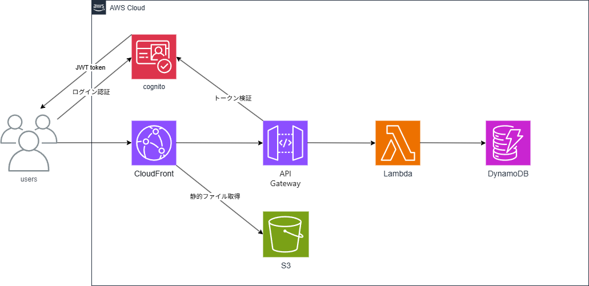

# serverless-memo-app
AWSのサーバーレス構成（Cognito / API Gateway / Lambda / DynamoDB / CloudFront / S3）で構築した認証付きメモアプリ。

## 概要（何を作ったか・目的）
CloudFormation を用いて、サーバーレス構成（Cognito / API Gateway / Lambda / DynamoDB / CloudFront / S3）を自動構築するテンプレートを作成しました。

本テンプレートの目的は以下です：

- サーバーレスの設計や構築を理解する  
- Cognito による認証の仕組みを理解する

## 構成 / アーキテクチャ

## 検証時の構成
- リージョン: ap-northeast-1（東京）
- Lambda ランタイム: Node.js 20.x
- DynamoDB: PAY_PER_REQUEST（オンデマンド=使用した分料金発生）
- CloudFront: HTTPS強制 / CachingDisabled（APIルートはユーザーごとに異なるデータを返すためキャッシュ無効）

## 使用技術
### AWS
- **Cognito**  
  - JWT認証 / Hosted UI（OAuth 2.0）
- **CloudFront**  
  - S3 からの静的コンテンツ配信および API Gateway へのリクエスト転送
- **S3**  
  - 静的コンテンツ保持用
- **API Gateway**  
  - API リクエストを受信し Lambda を呼び出す
- **Lambda**  
  - Node.js 20.x / メモの CRUD 処理
- **DynamoDB**  
  - メモデータ保存用
- **AWS CloudFormation**  
  - インフラをコードとして管理（IaC）

### 設計・その他
- **draw.io**：構成図作成  
- **GitHub**：テンプレートおよび README 管理

## CloudFormation構成の説明
本テンプレートでは、CloudFormation を用いて以下を自動構築します：

- Cognito
- API Gateway    
- Lambda
- DynamoDB 
- CloudFront
- S3

## デプロイ方法
1. CloudFormation でスタックを作成
2. **作成順序**  
   1. `dynamodb-stack`  
   2. `lambda-stack`  
   3. `api-stack`  
   4. `frontend-stack`  
   5. `cognito-stack`（`MemoFrontendUrlWithSlash` を参照するため最後）
3. S3 に静的コンテンツと Lambda 関数ファイルをアップロード

## 工夫・学習したポイント
- **Cognito** を活用し、ログイン認証を付与してセキュリティ面を考慮  
- **Outputs 定義**でログイン URL などを即座に参照可能  
- スタックごとに処理を分割し、役割を明確化  
- サーバーレス構成と処理の流れを理解

## 開発中に直面した課題と解決策

### 問題1
CloudFront 経由で `GET /memos` が 401 Unauthorized エラーとなった。  

**原因**：CloudFront はデフォルトでキャッシュ効率を優先するため、`Authorization` ヘッダーをオリジンに転送しない設計になっている。そのため API Gateway に認証情報が届かず 401 が返っていた。  
**解決策**：CloudFront → ビヘイビア → キャッシュポリシーを `CachingDisabled` に変更し、オリジンリクエストポリシーを `AllViewerExceptHostHeader` に設定することで全ヘッダー（Authorization含む）を転送

### 問題2
API Gateway に直接リクエストしても 403 Forbidden が返ってきた。  

**原因**：API Gateway はステージ（`dev` / `prod` など）単位でデプロイされるため、URL にステージ名が含まれていないと正しいエンドポイントにルーティングされない。  
**解決策**：URL にステージ名 `/dev` を含め、`https://{id}.execute-api.ap-northeast-1.amazonaws.com/dev/memos` に修正

### 問題3
Lambda が `Runtime.HandlerNotFound` エラーで 500 Internal Server Error を返す。  

**原因**：Lambda のハンドラー設定が `memo-lambda.handler` になっていたが、実際のファイルは `lambda/` サブフォルダ内にあったため、Lambda がファイルを見つけられなかった。  
**解決策**：Lambda のランタイム設定のハンドラーを `lambda/memo-lambda.handler` に修正

### 問題4
フロントエンドからのリクエストが 401 Unauthorized となった（トークンの種類が違う）。  

**原因**：`access_token` はスコープベースの認可用トークンであり、API Gateway の Cognito オーソライザーはユーザー情報（sub・email など）を含む `id_token` を要求する。  
**解決策**：`login.js` で `access_token` ではなく `id_token` を保存

### 問題5
フロントエンドで `Authorization: Bearer {token}` を送ったが 401 Unauthorized となった。  

**原因**：API Gateway の Cognito オーソライザーはトークンをそのまま検証するため、`Bearer ` プレフィックスが付いていると検証に失敗する。  
**解決策**：`api.js` の `Authorization: "Bearer " + getToken()` を`Authorization: getToken()` に修正

### 問題6
メモ一覧が表示されず空配列が返る。

**原因**：トークンが期限切れだったため、GET リクエストが 401 エラーになり空配列が返っていた。  
**解決策**：再ログインして `id_token` を再取得後に正常表示を確認

### 問題7
メモ追加後、一覧がすぐ更新されず再ログインすると表示される。  

**原因**：CloudFront が GET レスポンスをキャッシュしていたため、追加直後は古いデータが返り続けていた。  
**解決策**：CloudFront → ビヘイビア → キャッシュポリシーを `CachingDisabled` に変更、オリジンリクエストポリシーを `AllViewerExceptHostHeader` に設定

### 問題8
AWS Lambda 実行時に以下のエラーが発生した：

`Runtime.ImportModuleError: Cannot find module 'aws-sdk'`

**原因**：Node.js 20.x では `aws-sdk` v2 が Lambda ランタイムに含まれなくなったため、デプロイパッケージに同梱する必要がある。  
**解決策**：`@aws-sdk/client-dynamodb` を依存関係に追加し、`node_modules` ごとパッケージ化して Lambda にデプロイ
